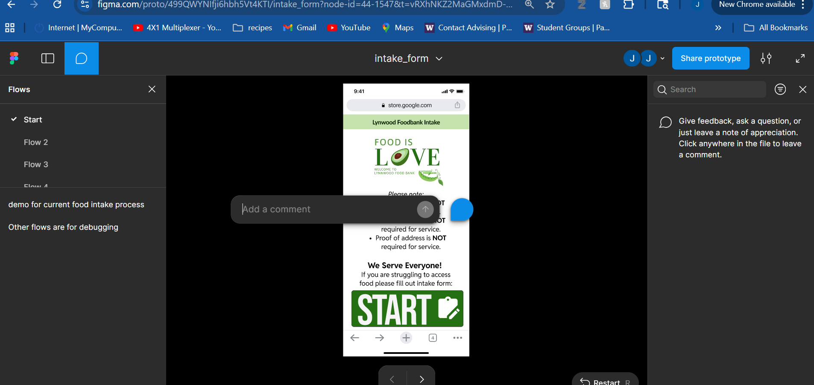
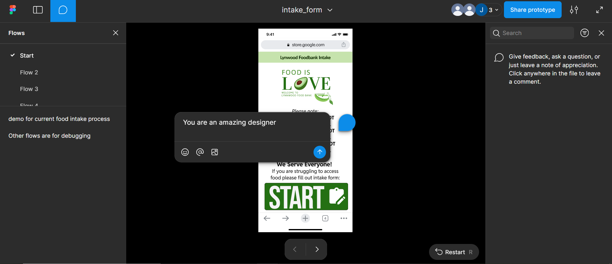

### How to Criticize our Interface

follow this link:

https://www.figma.com/proto/499QWYNIfji6hbh5Vt4KTI/intake_form?node-id=44-1547&t=vRXhNKZ2MaGMxdmD-0&scaling=scale-down&content-scaling=fixed&page-id=0%3A1&starting-point-node-id=44%3A1547&show-proto-sidebar=1

How to use Figma documentation:

You should arrive at this screen:

You can interact with the website as if it were your phone to explore all the graphic design I am proposing. If at any point you have a comment suggestion, or something which needs to be changed. Feel free to use the comment feature to add comments (the speech bubble on the top left).

you then click where you want to comment:

and add your information or tidbit.

Leaving the comment accessible for the design team to incorporate feedback.

I went ahead and fleshed out almost everything as it seems like volunteers time is limited. But don't let that dissuade you from giving criticism.

